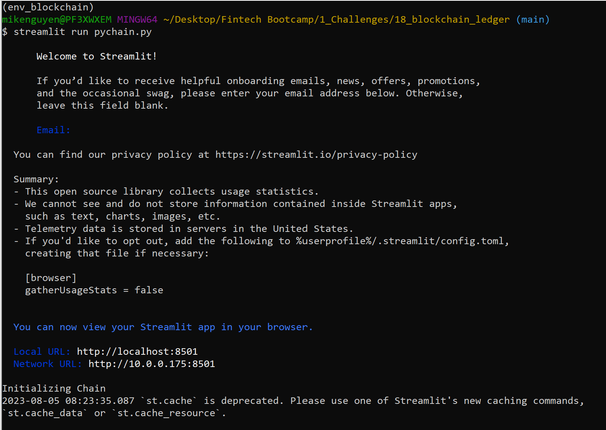

# Blockchain PyChain Ledger

You’re a fintech engineer who’s working at one of the five largest banks in the world. You were recently promoted to act as the lead developer on their decentralized finance team. Your task is to build a blockchain-based ledger system, complete with a user-friendly web interface. This ledger should allow partner banks to conduct financial transactions (that is, to transfer money between senders and receivers) and to verify the integrity of the data in the ledger.


## Technologies

Programming Languages: Python 3.7.13 

Libraries: 
- Pandas - a Python library that is used for data manipulation, analysis, and visualization. 
- Streamlit - an open-source Python library that is designed to create custom web applications for machine learning and data science projects. It allows you to turn your data scripts into interactive web applications with just a few lines of code, making it easier to share and visualize your results with others.
- Data Classes - a programming language feature that simplify the creation of classes primarily used to store and manage data. By using data classes, you can focus on defining the fields (attributes) of the class, and the Python interpreter will automatically generate various special methods for you.
- Hashlib - module commonly used for tasks like data integrity verification, password hashing, and creating unique identifiers. It provides secure hash algorithms, making it suitable for cryptographic applications.

Operating System(s):  Any operating system that supports Python, including Windows & macOS.

## Installation Guide

To run this analysis, make sure you install the necessary dependencies:

1. Install Python: https://www.python.org/downloads/
2. Clone the repository: git clone "https://github.com/mikenguyenx/18_blockchain_ledger.git" using git or download the ZIP file and extract it to a local directory.
3. Install the Streamlit library by running the following command:
```
pip install streamlit
```

## Usage

1. Open a terminal or command prompt and navigate to the directory with the python file.
2. In the terminal, run the Streamlit application by using streamlit run pychain.py.
```
streamlit run pychain.py 
```
3. Enter values for the sender, receiver, and amount, and then click the Add Block button. Do this several times to store several blocks in the ledger.

4. Verify the block contents and hashes in the Streamlit drop-down menu.

5. Test the blockchain validation process by using the web interface.




## Contributors

Mike Nguyen

## License

GNU General Public License v3.0